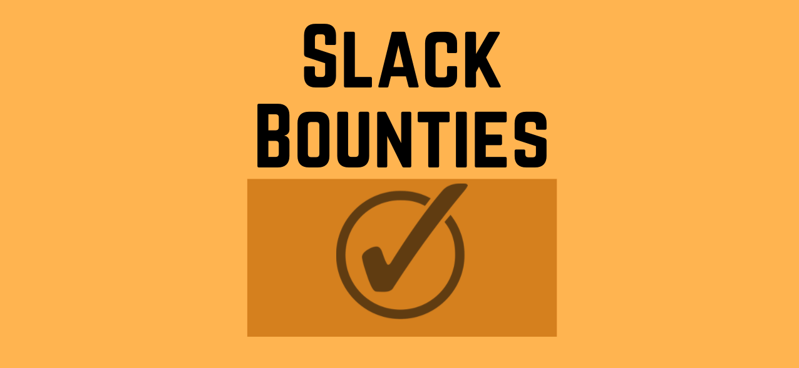
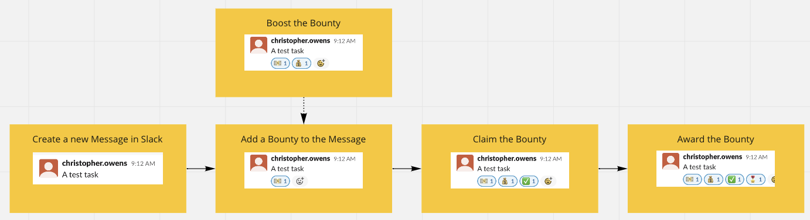
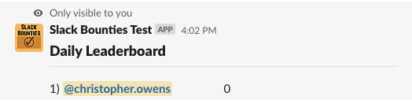
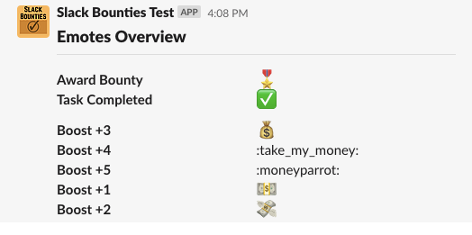
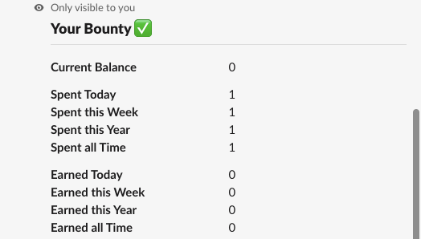
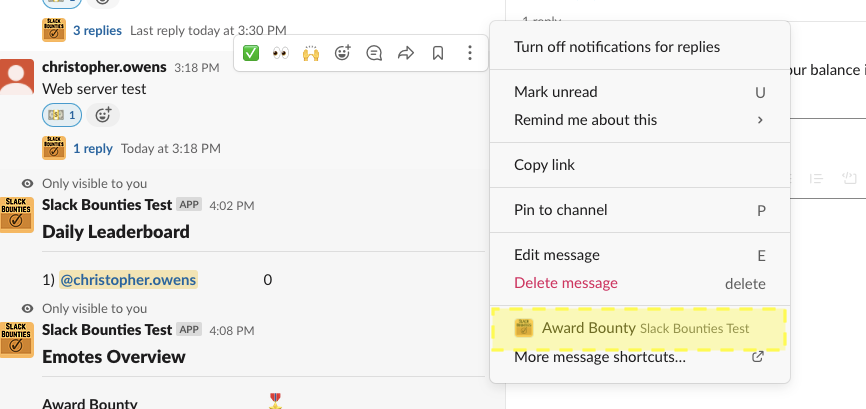
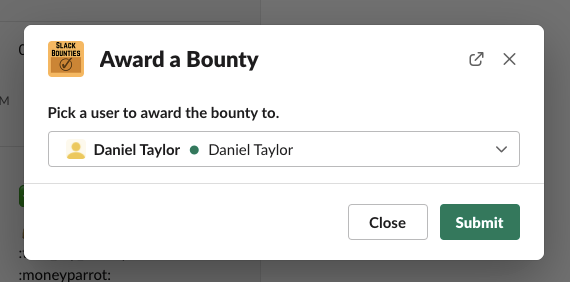
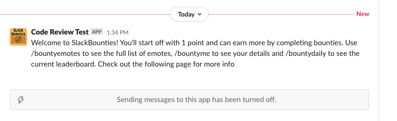

```
IMPORTANT: This is very much a proof of concept/prototype. It will probably go down, have loads of bugs and plenty of room for improvement. If you notice anything please let me know and I'll fix it up asap.
```


# What is it?
Slack bounties is a slack bot that aims to improve the code review process through gamification. Users are given the ability to offer 'bounties' on their MRs which are then awarded to reviewers. 

## Sample Scenarios
### Standard MR Review
This is a fairly typical flow for how the bounty process works.
- Christopher creates a new task message
- Christopher adds a bounty of 1 using the :cash: emote
- Someone else optionally  boosts the bounty by three using the :money_bag: emote
- Once the task is complete, the completer requests to claim the bounty using the :check: emote
  - Note that this step can be skipped by using the 'Award a Bounty' interaction described further below
- Christopher awards the bounty using the :medal: emote
  - Note that the `Award a Bounty` interaction can also be used for this step



### Boosting a Bounty
- Chris has a large MR and he needs to get it reviewed
- He posts the MR in the code review channel and offers a bounty of 1 by adding a :cash: emote to the message
  - His balance is reduced by 1
- Nobody is in a hurry to review his MR as it's large and there's only a small bounty
- Andrew also wants this MR to go out ASAP so he boosts it by adding a :money_bag: emote
  - Andrew's balance is reduced by 3 and the bounty on the message is increased to 4
- Alex sees the new bounty and decides that it's probably worth doing for the 4 points, he reviews it and adds the :tick: emote
- Chris awards the bounty by adding the :medal: emote
### Earning Points
- Chris posts his MR to the code-review channel but doesn't have enough points to add a bounty
- In order to get some points for his own MR Chris reviews Daniel's MR which has a bounty of 3 points
- Once Chris has finished reviewing the MR he adds the :check: emote
- Daniel awards Chris the bounty with the :medal: emote
- Chris uses the :money_with_wings: emote to add a 2 point bounty to his MR

## Where to see it?
There is currently a prototype setup in a new slack. The bot will be tested there and potentially move to the main slack if it is accepted/approved. You can join using the following link: https://join.slack.com/t/slackbountiestest/shared_invite/zt-xg6hhh2s-Y3NFdIPf_A_7P~WeJeqEVw

## Slash Commands
### Leaderboards
These slash commands show the current leaderboards for the channel. Note that in order to avoid anyone feeling uncomfortable we limit the number of users shown on the leaderboard. Currently this is set to the top 30 percent of users (max of 10 rows) but will likely change depending on feedback.

There are a few options that can be used:

- /bountydaily
- /bountyweekly
- /bountyyearly
- /bountyalltime



### Emotes
The /bountyemotes slash command is simply used as a refresher to help remind people how each of the emotes can be used.



### Me
The /bountyme slash command is used to show the current user's stats in the channel. It's currently the main way for a user to keep an eye on their balance, earnings, etc.




## Interactions
Interactions are drop down menus on items within slack. They allow us to open a modal and provide a more structured workflow for users.

### Award a Bounty
This interaction allows the user to award a message's bounty to a specific user and helps to circumvent a couple of minor issues with the emote only flow. It can opened by clicking on the dropdown next to a message and selecting a the `Award Bounty` option. 



Once that interaction context menu has been clicked it will open a modal allowing for the message's bounty to be awarded.



Clicking `Submit` will award the bounty (if eligible) to the target user.

## Background Functionality
While most of the bot is driven through emotes, slash commands and interactions there are still a number of components that rely on background processing.

### Leaderboards
At the end of each interval (daily, weekly, yearly) a leaderboard will automatically be posted to each channel using the bot. These leaderboards are currently identical to those that are accessible via the slash commands except for the fact that they are shown to the whole channel and not just the active user.

### Decay and Income
On each daily reset a decay and income is applied to all accounts. The decay is used to prevent hoarding and to ensure that there's a reason for people to remain active. The income is applied as a slight balance increase immediately after the decay. The current configuration applies a decay of 2 and an income of 1 but this values are very likely to change as we get more feedback.

### Resets
Points that are spent and earned are tracked on a daily, weekly, monthly, yearly and all time basis. Each day we perform a check to see if these need to be reset.

### Initial Welcome Message
When a user triggers account creation for the first time they'll receive a PM from the bot. The message simply gives a brief overview and a link to where they can find more info (currently this page).



### Removing Bot Messages
When a user adds an emote incorrectly the bot sends a friendly reminder asking them to remove it. In order to make this process more friendly we bind to the "reaction_removed" event. This allows us to delete the message when the user has corrected the action.

## FAQ
### Can I still get reviews if I don't offer a bounty?
Yes. This bot doesn't interfere with the current process it simply sits on top.

### Is there any reporting or monitoring on those that aren't doing as many reviews?
No. We intentionally only record balances, individual transactions are not saved to the database. Leaderboards are also limited to the top 30% of users (a max of 10).  Even with full access to the database only the user's latest daily, weekly, monthly, yearly and all time balances are available. 

### What permissions does the bot use? I don't want it to see messages.
The bot uses the minimum permissions required to interact with the channel. It does not have access to any of the channel's messages and only stores reference ids in the database. You can view the manifest for the full details but the main ones are as follows:
- Write messages to a channel
- Sending private messages
- Seeing when a reaction is added
- Seeing when a reaction is removed

### Can the bot be used for anything other than merge/pull requests?
Definitely! MRs are what I needed it for but it can probably be used for most slack based tasks as well.
